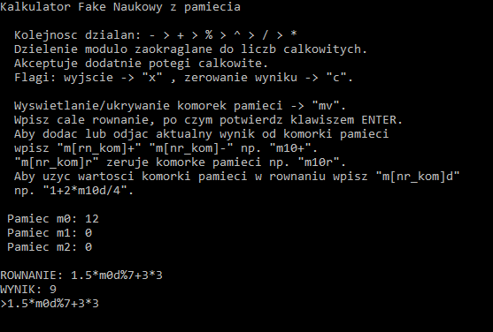

# OOP
## Opis projektu
Projekt kalkulatora naukowego z pamięcią, umożliwiającego wybór pomiedzy kalkulatorem prostym, oraz kalkulatorem naukowym z pamięcią, obługującym spersonalizowaną kolejność działań. Aplikacja oblicza wynik równania na podstawie wprowadzonego kompletnego ciągu znaków opisującego równanie, a także umożliwia odczyt oraz modyfikację wartości komórek pamięci na dowolnej pozycji równania. Rozmiar pamięci pomiędzy 0 - 100 komórek.

## Zrzut ekranu

  

